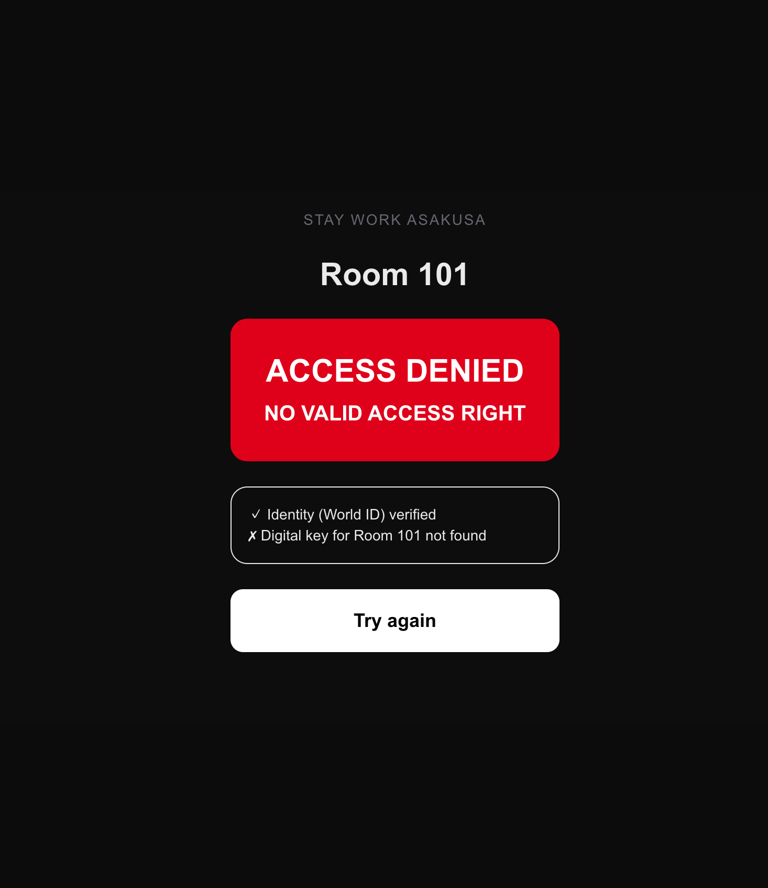
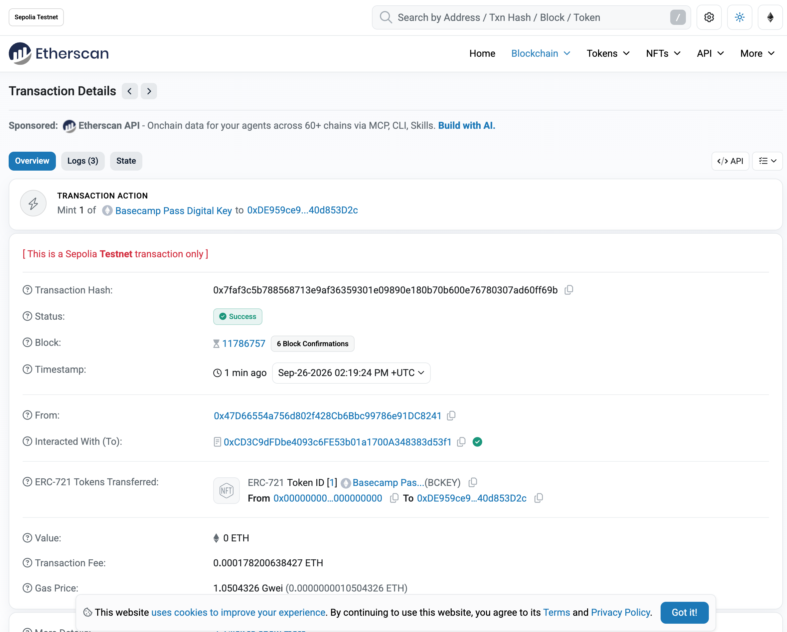
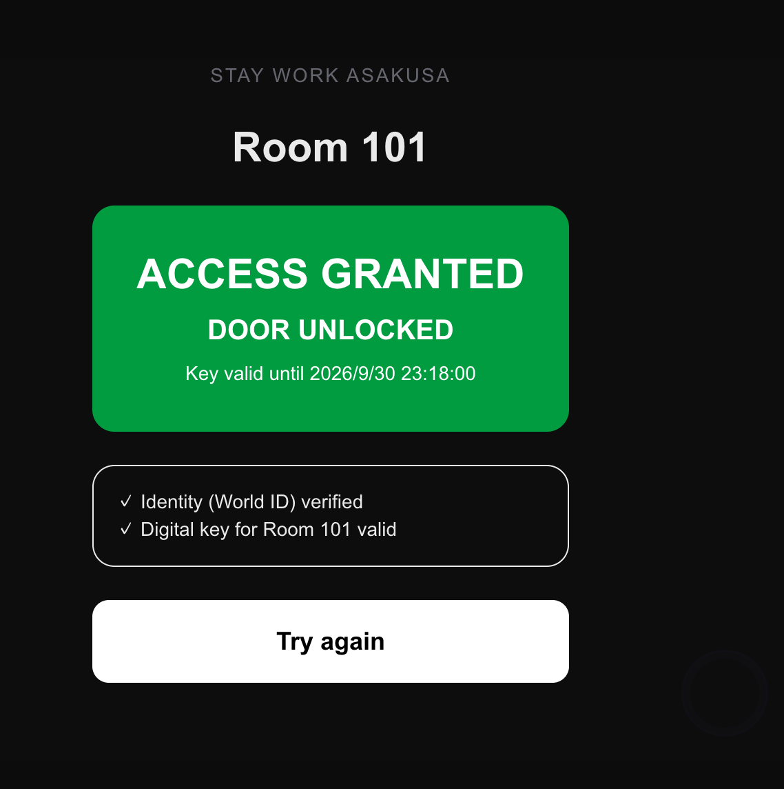
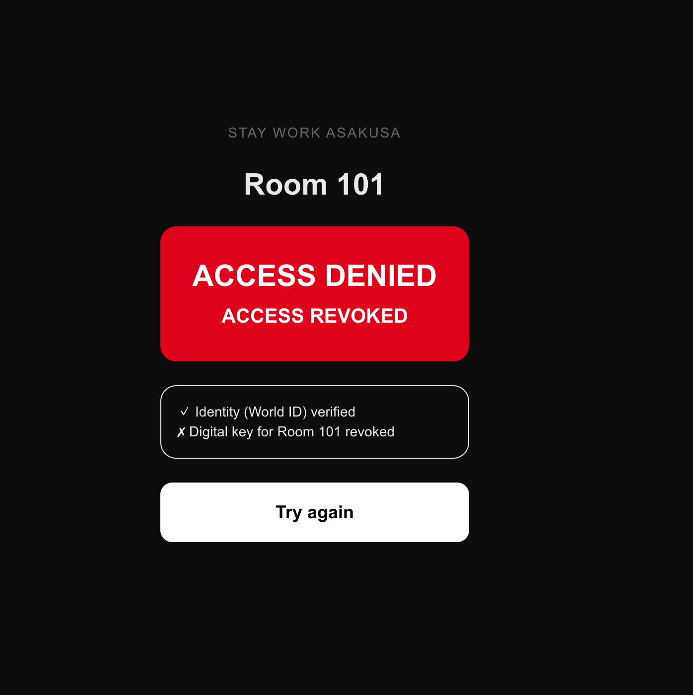

# Basecamp Pass

**World ID says who you are. Ethereum says whether you may enter.**

A digital key for vacant houses (akiya) and guesthouses in Japan. A guest proves their identity with
World ID (passport or My Number Card, with a live face check), the property manager issues a
**non-transferable access key on Ethereum**, and the door opens only when **both** are true:

1. the person is verified with World ID, **and**
2. that same person holds a valid on-chain key for this room right now.

Passing World ID alone never opens the door.

- Live demo: https://basecamp-pass.vercel.app (door: `/door`, digital key: `/key`, manager: `/admin`)
- Contract (Ethereum Sepolia): [`0xcd3c9dfdbe4093c6fe53b01a1700a348383d53f1`](https://sepolia.etherscan.io/address/0xcd3c9dfdbe4093c6fe53b01a1700a348383d53f1)
- Built at ETHGlobal Tokyo 2026 (From Scratch)

## Why

Toru runs a guesthouse in Asakusa (STAY WORK) and helped a working-holiday visitor settle in Japan:
an address, a phone, a bank account, the local festival, a job hunt. The plan is to turn Japan's cheap
vacant houses into a **basecamp** for travelers and working-holiday makers: stay, leave your luggage,
travel, come back. A stranger is about to get the key to a home, and Japanese minpaku law requires an
identity check and a guest register for every person who stays.

The long-term flow is **Identity → Contract → Payment → Access Right → Physical Access**:

| Layer | Piece | Status |
|---|---|---|
| Identity | World ID (passport / My Number Card + face check) | ✅ working in production |
| Access Right | Soulbound access key on Ethereum | ✅ working in production (Sepolia) |
| Physical Access | Door screen (smart-lock adapter in `src/lib/lock.ts`) | ✅ screen; lock API not connected |
| Contract | E-contract for a fixed-term lease | explained only |
| Payment | JPYC | future |

## Demo (production, real World App + My Number Card)

Same person every time. World ID succeeded all three times; only the on-chain key changed.

| Time (JST) | Action | World ID | Key on Ethereum | Door |
|---|---|---|---|---|
| 09-26 23:18 | before any key | ✓ | none | **ACCESS DENIED** – no valid access right |
| 09-26 23:19 | manager issues key #1 ([tx](https://sepolia.etherscan.io/tx/0x7faf3c5b788568713e9af36359301e09890e180b70b600e76780307ad60ff69b)) | | active | |
| 09-26 23:24 | at the door | ✓ | active | **ACCESS GRANTED** – door unlocked |
| 09-26 23:26 | manager revokes key #1 ([tx](https://sepolia.etherscan.io/tx/0x92457fa0637101a5781c24f378082fedf8a5aefc52b43a6058bb49827f466584)) | | revoked | |
| 09-26 23:27 | at the door | ✓ | revoked | **ACCESS DENIED** – access revoked |

| Verified, no key → denied | Key issued on chain | Verified + key → granted | Key revoked → denied |
|---|---|---|---|
|  |  |  |  |

Manager screen: [before issue](docs/screenshots/05-admin-before-issue.png) ·
[key issued](docs/screenshots/06-admin-key-issued.png) · [key revoked](docs/screenshots/09-admin-key-revoked.png)

## How it works

```
Phone (World App)          Door screen / server                    Ethereum Sepolia
─────────────────          ────────────────────                    ────────────────
scan QR, prove passport ──▶ verify proof with World (v4 verify API)
or My Number Card           → nullifier (same person = same value)
                            → holder address = f(nullifier, server secret)
                            → hasValidAccess(holder, "STAYWORK-ASAKUSA-101") ──▶ AccessKey
                            ◀────────────────────────────── true / false ────────
                            GRANTED → unlock   /   DENIED → reason
```

### The access key contract — [`contracts/AccessKey.sol`](contracts/AccessKey.sol)

- ERC-721 + **ERC-5192 (soulbound)**: `transferFrom`, `safeTransferFrom`, `approve` and
  `setApprovalForAll` all revert, so a key cannot be passed on or sold.
- Each key stores only `roomId`, `validFrom`, `validUntil`, `revoked`.
- `issue(holder, roomId, validFrom, validUntil)` and `revoke(tokenId)` — property manager only.
- `hasValidAccess(user, roomId)` is true only if `validFrom <= now <= validUntil` and not revoked.
- `statusOf(tokenId)` → `NOT_YET_VALID` / `ACTIVE` / `EXPIRED` / `REVOKED`.

### No personal data on chain

On chain: holder address, token id, room id, time window, status. That is all.
Names, addresses, My Number, passport numbers, face images and even the World ID nullifier stay off chain.

Guests need **no wallet**. The server derives one holder address per person from the World ID nullifier
and a server secret (HMAC). The same person always gets the same address, and the address cannot be
linked back to the nullifier without the secret.

### Who uses what

- **Guest** — `/key`: a boarding-pass style card (property, room, status, valid until) and an UNLOCK
  button. No crypto words.
- **Door** — `/door`: shows the QR, then two lines: "Identity (World ID) verified" and
  "Digital key for Room 101 valid / not found / revoked / expired".
- **Property manager** — `/admin`: people verified with World ID, their keys read from chain, issue /
  revoke, door log.
- **Friend invite** — the host invites a friend; when the friend verifies, a key for exactly the stay
  window is minted to the friend. It expires on chain by itself.

## Tests

`scripts/test-local.sh` starts anvil, deploys the contract and runs the same `src/lib/chain.ts` the app uses.
Two different nullifiers stand for contract holder A and friend B:

```
PASS  A and B map to different holders
PASS  A before issue → denied
PASS  A after issue → GRANTED
PASS  A other room → denied
PASS  B (no key) → DENIED
PASS  transfer A → B reverts
PASS  B still denied after transfer attempt
PASS  B key not yet valid → denied
PASS  B inside window → granted
PASS  B after window → EXPIRED denied
PASS  A after revoke → REVOKED denied
… 15 / 15 PASS
```

Full output: [`docs/local-test-result.txt`](docs/local-test-result.txt)

## Honest status / known limits

- **A second real person (friend B) was not tested in production.** Our helper could not come on the
  night. B's denial is covered by the local tests above, and the production run shows the same rule
  on one person (verified but no key → denied).
- **World ID staging simulator**: every simulator identity and credential returned the **same nullifier**,
  so two people cannot be told apart in staging. We reported this to the World team at the booth
  (details and the debug page in [`PLAN.md`](PLAN.md)). Production gives a unique nullifier per person.
- World ID 4.0 `any(passport, mnc)` constraints returned `credential_unavailable` for a real My Number
  Card holder; the legacy document preset works and is used.
- The simulator cannot run the live face check, so the face check is requested in production only.
- No physical smart lock is connected; `src/lib/lock.ts` is the adapter to swap for a SwitchBot / SESAME call.
- The admin screen is protected by a simple passcode (demo level).

## Run it

```bash
npm install
node scripts/compile.mjs                 # solc-js → src/lib/AccessKey.json
ISSUER_PRIVATE_KEY=0x… node scripts/deploy.mjs   # prints the contract address
./scripts/test-local.sh                  # local anvil tests (needs Foundry's anvil)
npm run dev
```

Environment: `NEXT_PUBLIC_WORLD_APP_ID`, `NEXT_PUBLIC_WORLD_RP_ID`, `NEXT_PUBLIC_WORLD_ENV`, `RP_SIGNING_KEY`,
`DATABASE_URL` (Neon), `ACCESS_KEY_ADDRESS`, `ETH_RPC_URL`, `ISSUER_PRIVATE_KEY`, `HOLDER_SECRET`, `ADMIN_PASSCODE`.

## Stack

Next.js 16 · World ID (IDKit 4, Developer Portal v4 verify) · Solidity 0.8 + OpenZeppelin 5 · viem ·
Ethereum Sepolia · Neon Postgres · Vercel. AI use is logged in [`AI_USAGE.md`](AI_USAGE.md).
